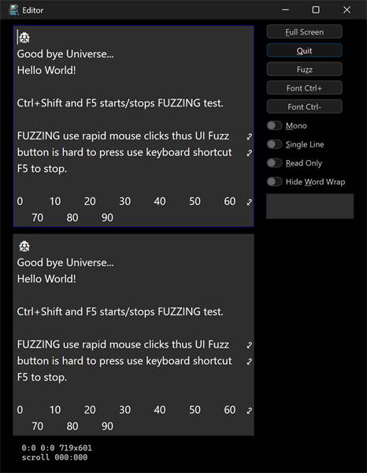

# editor



A multi-document text editor. Two edit views stack vertically (the focused
one has a blue frame), each showing the same starter text and a column
ruler. A panel on the right holds buttons and toggles.

## What it demonstrates

- The `ui_edit_view` / `ui_edit_doc` text editing controls.
- Several editors over independent documents.
- Switching between monospaced and proportional fonts, and scaling the
  font up and down.
- Common editor options as toggles: Mono, Single Line, Read Only, and
  Hide Word Wrap.
- A built-in fuzzing self-test driven from the UI.

## Key code

The text model and the editing view are separate: a `ui_edit_doc` holds the
text, and one or more `ui_edit_view`s edit and render it:

```c
ui_edit_doc.init(&doc, text, (int32_t)bytes, false); // the text model
ui_edit_view.init(&edit, &doc);                      // a view onto it
edit.view.fm    = &ui_app.fm.mono.normal;            // monospaced font
edit.view.max_w = ui.infinity;                       // fill available space
edit.view.max_h = ui.infinity;
ui_view.add(parent, &edit.view, null);
```

- `edit0..edit2` are views bound to `edit_doc_0..2`; the arrays `edit[]`
  and `doc[]` make it easy to act on all of them, and `focused()` reports
  which one last had focus.
- `mf` / `pf` are the monospaced and proportional font metrics; `fs[]` is
  the table of scale factors and `fx` indexes it (Font Ctrl+ / Ctrl-).
- The view is split into `left`, `right`, and `bottom` containers; the
  right panel carries the buttons and toggles.
- The Fuzz button (or Ctrl+Shift+F5) starts and stops a fuzzing test that
  drives the editor with rapid synthetic input.

## Window and layout

- Opens at 4 x 5 inches; minimum 3 x 2.5 inches.
- Editors stack vertically on the left; controls sit in the right panel; a
  status stack runs along the bottom.

## Run it

Set `editor` as the startup project and press F5, or run
`bin\debug\x64\editor.exe`. Press F5 to start or stop the fuzzing test.

---

Prev: [groot](groot.md) | Next: [guardians](guardians.md)

[Index](README.md)
