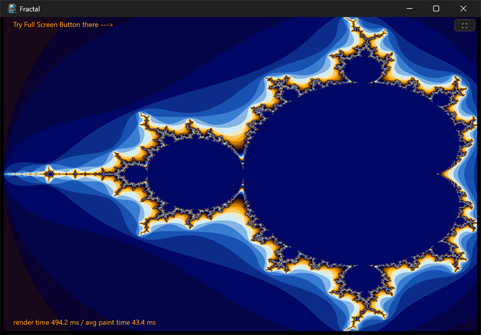

# fractal



A minimal Mandelbrot renderer. The set fills the window; a hint at the top
left points to the full-screen button at the top right, and a line at the
bottom reports the render time and the average paint time.

## What it demonstrates

- Off-loading slow work to a background render thread so the UI stays
  responsive (`posix_thread`, `posix_event` for wake / quit signalling).
- Double buffering with two `ui_bitmap` images: one is shown while the
  other is being rendered, then they are swapped.
- Re-rendering when the window is resized.
- A full-screen toggle button and keyboard handling.

## Key code

The render thread sleeps until woken, fills the buffer that is not on
screen, then flips which buffer is shown:

```c
static void renderer(void* unused) {
    posix_event_t es[2] = { wake, quit };
    for (;;) {
        if (posix_event.wait_any(2, es) != 0) { break; }  // quit
        int32_t k = !index;            // the buffer not being shown
        mandelbrot(&image[k]);
        if (!stop) { index = !index; ui_app.request_redraw(); }
        rendering = false;
    }
}
```

- `image[2]` plus `pixels[2][...]` are the two buffers; `index` selects the
  one currently shown.
- `measure` notices a size change, re-creates the back buffer at the new
  size, and calls `request_rendering` (which sets the wait cursor and signals
  the `wake` event).
- `paint` blits the current image to fill the view and draws the hint and
  timing text; `layout` keeps the button pinned to the top right.

## Window and layout

- Opens at 6 x 4 inches; minimum is the same (6 x 4).
- The render fills the whole content area; only the button is positioned
  explicitly (top right).

## Run it

Set `fractal` as the startup project and press F5, or run
`bin\debug\x64\fractal.exe`. Resize to re-render; press the top right button
(or F) for full screen.

---

Prev: [mandrill](mandrill.md) | Next: [timers](timers.md)

[Index](README.md)
