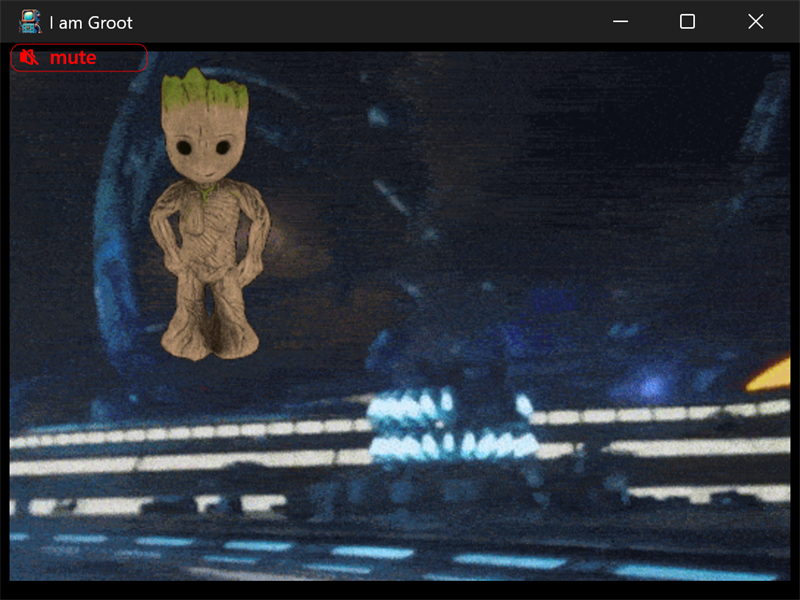

# groot



A dancing Groot sprite animates over a moving space backdrop, while a MIDI
tune plays in a loop. The title bar reads "I am Groot".

## What it demonstrates

- Loading animated GIFs with stb_image (`stbi_load_gif_from_memory`),
  including per-frame delays.
- Using one animated GIF as a full-window backdrop and another as a sprite.
- Running animation steps on the dispatch (UI) thread with `ui_app.post`.
- A background loader thread (`posix_thread`) for decoding.
- Looping MIDI playback through `ui_midi`.
- A small mute button drawn and hit-tested by hand, avoiding container
  layout for a single control.

## Key code

stb_image returns every frame of a GIF, plus its per-frame delays, in one
call; animation steps are then posted to the UI thread:

```c
// frames, delays, w, h, frame count, bytes-per-pixel all come back at once
stbi_uc* px = stbi_load_gif_from_memory(data, (int32_t)bytes,
                  &delays, &w, &h, &frames, &bpp, preferred_bpp);

// advancing a frame is posted to the dispatch (UI) thread, so updates
// stay in step with painting:
ui_app.post(...);
```

- `animated_gif_t` holds a decoded GIF; `animation_t` adds position,
  velocity, and the current frame index. There is one of each for the
  Groot sprite and one for the movie backdrop.
- `midi_file` unpacks the embedded "mr_blue_sky_midi" resource to a
  temporary file (the Win32 MIDI API plays from a file, not memory) and the
  song loops; a hand-made mute button toggles `muted` / `volume`.

## Window and layout

- Opens at 4 x 3 inches; minimum is the same (4 x 3).
- The backdrop fills the window; the Groot sprite and the mute button are
  positioned directly.

## Run it

Set `groot` as the startup project and press F5, or run
`bin\debug\x64\groot.exe`. Click the mute button (top left) to silence the
music.

---

Prev: [timers](timers.md) | Next: [editor](editor.md)

[Index](README.md)
