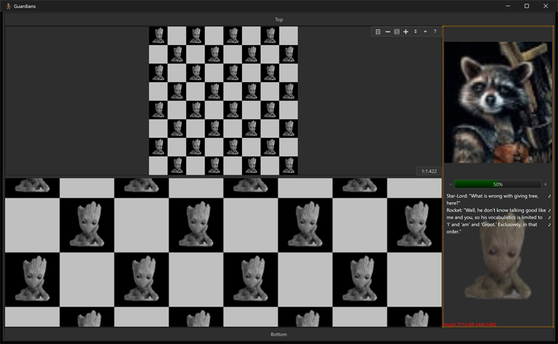

# guardians



A composition of several views over one image set. A grayscale image is
shown tiled over a checkerboard (so its transparency is visible) in two
views, top and bottom. On the right are a Rocket image, a slider, an
editable block of Groot / Rocket / Star-Lord dialog, and a Groot image.

## What it demonstrates

- Embedding images directly in the source as headers (`groot.h`,
  `rocket.h`) and decoding them with stb_image.
- Multiple `ui_image` views over the same underlying image data.
- Showing transparency by compositing over a checkerboard background.
- An `ui_edit_view` bound to a `ui_edit_doc` for an editable text block.
- A slider and labelled panels combined in one window.

## Key code

Each embedded byte array is decoded once into a `ui_bitmap`; several views
can then present the same image data different ways:

```c
static void init_image(struct ui_bitmap* i, const uint8_t* data,
                       int64_t bytes) {
    int32_t w = 0, h = 0, c = 0;
    void* pixels = stbi_load_from_memory(data, (int32_t)bytes,
                                         &w, &h, &c, 0);
    ui_draw.bitmap_init(i, w, h, c, pixels);
    stbi_image_free(pixels);
}
```

- `view_groot`, `view_rocket`, and `view_gs[2]` are `ui_image` views;
  `view_gs[0]` and `view_gs[1]` look at the same grayscale image so the
  same data is shown two ways.
- `view_text` / `document` provide the editable dialog block.
- Panels are labelled "Top" and "Bottom"; the right column stacks the
  Rocket image, the slider, the text, and the Groot image.

## Window and layout

- Opens at 10 x 6 inches; minimum 5 x 4 inches.
- Two image views fill the left; a vertical stack of controls and images
  fills the right column.

## Run it

Set `guardians` as the startup project and press F5, or run
`bin\debug\x64\guardians.exe`.

---

Prev: [editor](editor.md) | Next: [layout](layout.md)

[Index](README.md)
