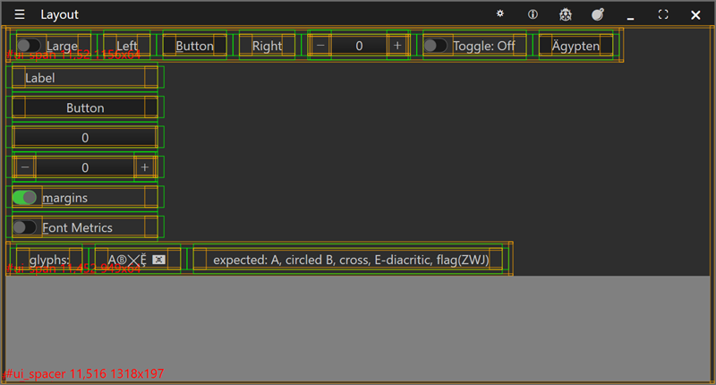
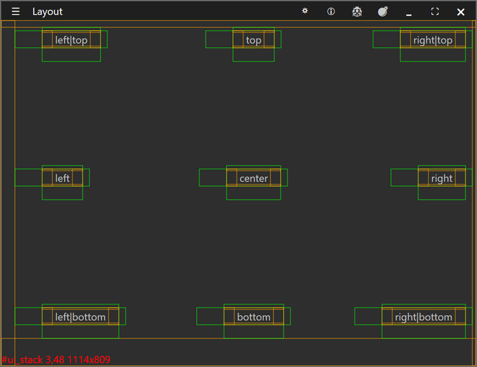
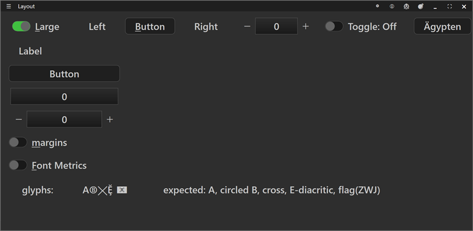
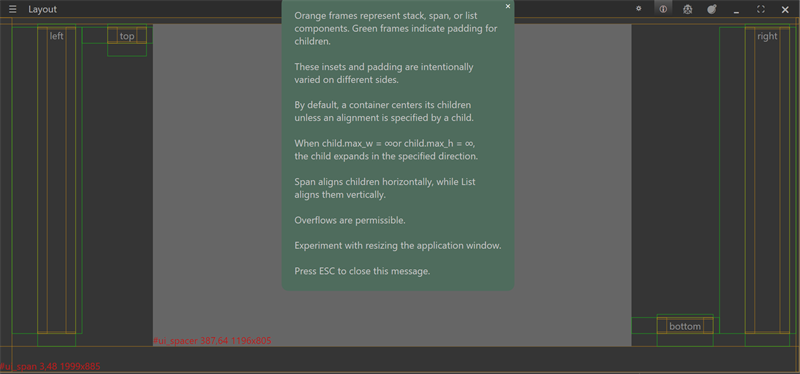

# layout



A guided tour of the layout engine. A toolbar (behind the caption menu
button) switches between five views: Stack, Span, List, Controls, and
Edit 1. The shot above is the Controls view with the debug overlay on, so
every container and every child is outlined.

## What it demonstrates

- The three container kinds: `ui_view(stack)`, `ui_view(span)`, and
  `ui_view(list)`.
  - stack: children overlap and align within the same box.
  - span: children are laid out left to right.
  - list: children are laid out top to bottom.
- Alignment with `ui.align.left / right / top / bottom / center`, and
  combinations such as `left | top`.
- Insets (a container's inner margin) and per-child padding, set
  intentionally different on each side.
- Expansion: a child with `max_w = ui.infinity` or `max_h = ui.infinity`
  grows to fill its direction; a `ui_view(spacer)` soaks up free space.
- A gallery of widgets, including a button with non-ASCII text
  ("Ägypten"), and a Large toggle that scales every control to the H1 font.
- A "Font Metrics" toggle that overlays each control's font metrics; see
  the diagram below.
- Toasts / popups: an About message box that slides down over the content.
- A glyph-rendering check (see below).
- Persisting UI state between runs (`ui_app.data_save` / `data_load`).
- A borderless window with a custom caption (`no_decor`).

## Key code

Each view builder rebuilds the `test` container with one arrangement. The
pattern is: make a container, set its insets and expansion, then add
children with an alignment:

```c
static struct ui_view list = ui_view(list);    // top-to-bottom container
list.insets = (struct ui_margins){ 1.0, 0.5, 0.25, 2.0 }; // inner margin
list.max_w  = ui.infinity;                      // expand to fill width
list.max_h  = ui.infinity;
ui_view.add(parent,
    ui_view.add(&list,
        align(&label,  ui.align.left),
        align(&button, ui.align.left),
    null),
null);
```

`align(view, flags)` is a one-line helper that sets `view->align` and
returns the view, so children read top to bottom in the `add` call.

## Reading the debug overlay

When the "margins" toggle is on (or the Debug caption button), the engine
draws its measurements:

| Color  | Meaning                                                       |
| ------ | ------------------------------------------------------------ |
| orange | a container's box (stack / span / list) and its inset edge   |
| green  | a child's padding box                                        |
| red    | a measured-size label, e.g. "#ui_span ... 949x64"            |

## The views

The Stack view aligns nine labels to the box corners, edges, and center -
a clean map of every alignment:



The Large toggle swaps every control to the H1 font, to check that the
layout reflows around bigger content:



The About button shows a message box as a toast that slides down over the
current view (here over the Stack debug frames):



## The glyph row

The Controls view's "glyphs:" row renders a deliberately tricky string and
a note of what to expect: a capital A, a circled B, a cross, an E with
cedilla and breve, and a pirate flag. The circled B uses a precomposed code
point (U+24B7), which renders cleanly, rather than a combining enclosing
circle, which GDI and DirectWrite draw as a stray arc. The pirate flag is a
ZWJ emoji sequence; under the GDI text path it falls back to a monochrome
placeholder (color emoji would need the DirectWrite color path).

## Font metrics

The "Font Metrics" toggle overlays the lines that a `struct ui_fm` records
for a font: the em box, the ascent and descent relative to the baseline,
and the total height. This is the diagram from the source (above the
`struct ui_fm` definition in `include/ui/ui_draw.h`), and it is exactly why
the "Ägypten" button exists -- the umlaut sits in the space above the
ascent:

```
   Example em55x55 H1 font @ 192dpi:
    _   _                   _              ___    <- y:0
   (_)_(_)                 | |             ___ /\    "diacritics circumflex"
     / \   __ _ _   _ _ __ | |_ ___ _ __       ||
    / _ \ / _` | | | | '_ \| __/ _ \ '_ \      ||    .ascend:30
   / ___ \ (_| | |_| | |_) | ||  __/ | | |     ||     max extend above baseline
  /_/   \_\__, |\__, | .__/ \__\___|_| |_| ___ || <- .baseline:44
           __/ | __/ | |                       ||    .descend:11
          |___/ |___/|_|                   ___ \/     max height of descenders
                                                  <- .height:55
  em: 55x55
  ascender for "diacritics circumflex" is (h:55 - a:30 - d:11) = 14
```

## Window and layout

- Opens at 10 x 7 inches, borderless.
- The Controls view is the most widget-dense; the Stack / Span / List views
  best show the engine itself.

## Run it

Set `layout` as the startup project and press F5, or run
`bin\debug\x64\layout.exe`. Use the caption menu button (top left) to open
the toolbar and switch views; toggle "margins" to see the debug overlay.

---

Prev: [guardians](guardians.md) | Next: [mandelbrot](mandelbrot.md)

[Index](README.md)
