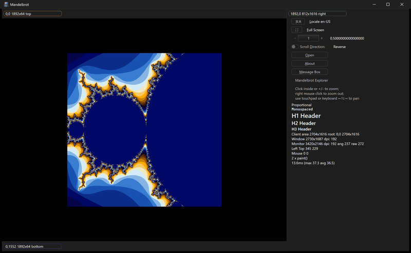

# mandelbrot



A full Mandelbrot explorer, and the most complete sample. The fractal is
drawn in the center; a panel on the right carries the controls and a live
readout; thin panels run along the top and bottom. Each panel is labelled
with its own position and size. The animation shows the locale button
switching the right-panel text between English and Simplified Chinese.

## What it demonstrates

- A four-panel layout (top, center, right, bottom) built from
  `ui_view(stack)` panels with custom `measure`, `layout`, and `paint`.
- Interactive zoom and pan: click to zoom in (with a zoom history stack),
  right-click to zoom out, +/- keys, arrow keys and the touchpad to pan,
  and a zoom slider.
- A range of controls: a locale toggle, full-screen toggle, a scroll-
  direction toggle, an Open file dialog, an About box, and a Yes/No
  message box (`ui_mbx`) shown as toasts.
- Internationalization: switching the locale between en-US and zh-CN with
  `posix_nls` and the strings in `i18n.h`.
- Copying the rendered image to the clipboard (Ctrl+C,
  `posix_clipboard.put_image`).
- A live diagnostics readout: client / window / monitor sizes, DPI, mouse
  position, paint count and timing, and font samples.

## Key code

The panels are not auto-laid-out; `measure` sizes them from the window's
content area and `layout` positions them. This is how to build a fixed
frame around a custom-drawn center:

```c
static void measure(struct ui_view* v) {
    const int32_t w = ui_app.root->w, h = ui_app.root->h;
    panel_top.w   = (int32_t)(0.70 * w);  // top/bottom span 70% width
    panel_top.h   = v->fm->em.h * 2;
    panel_right.w = w - panel_top.w;       // right panel takes the rest
    panel_right.h = h;
    panel_center.w = panel_top.w;
    panel_center.h = h - panel_top.h - panel_bottom.h;
}
```

- The fractal is rendered into a fixed 1024 x 1024 `ui_bitmap` by
  `mandelbrot()`; `refresh()` re-renders after any zoom or pan.
- `zoom_in` / `zoom_out` push and pop a small stack of center points, so
  zooming out retraces the path zoomed in.
- `panel_paint` draws each panel's frame and its "x,y wxh name" label;
  `right_paint` lays out the readout text; `center_paint` blits the fractal
  centered. `tap`, `character`, `keyboard`, and `mouse_scroll` handle zoom
  and pan.

## Window and layout

- Opens at 10 x 6 inches; minimum 9 x 5.5 inches.
- Top and bottom panels are 70% of the width; the center holds the fractal;
  the right panel holds every control and the readout.

## Run it

Set `mandelbrot` as the startup project and press F5, or run
`bin\debug\x64\mandelbrot.exe`. Click the fractal to zoom in, right-click to
zoom out, and use the locale button to switch language.

---

Prev: [layout](layout.md)

[Index](README.md)
