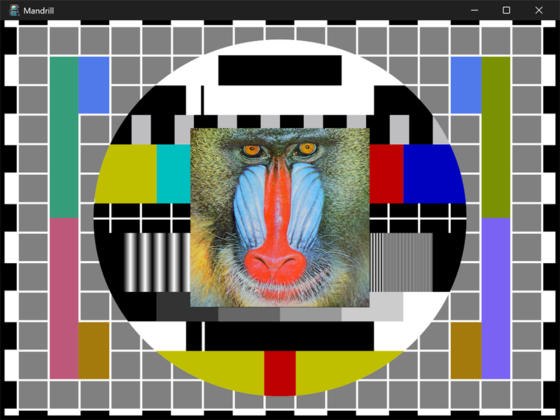

# mandrill



An image viewer. The classic mandrill (baboon) test image is centered on
top of an embedded test-card image that fills the background.

## What it demonstrates

- Decoding images with stb_image (`stbi_load_from_memory`).
- Two image sources: a file downloaded at first run, and an image embedded
  in the executable as a resource.
- Memory-mapping a file (`posix_mem.map_ro`) and mapping a resource
  (`posix_mem.map_resource`).
- Forcing the GUI subsystem: a console entry point asserts so the program
  only runs as a windowed app.

## Key code

Bytes from a mapped file or an embedded resource are decoded by stb_image
and handed to a `ui_bitmap`; drawing is one call:

```c
// decode bytes -> pixels, then wrap them in a ui_bitmap
void* pixels = stbi_load_from_memory(data, (int32_t)bytes,
                                     &w, &h, &bpp, 0);
ui_draw.bitmap_init(&image[i], w, h, bpp, pixels);
stbi_image_free(pixels);

// in paint(): blit the bitmap (here scaled to fit the view)
ui_draw.bitmap(x, y, w, h, 0, 0, image.w, image.h, &image);
```

- `init` builds the target path under the user's Pictures folder
  (`posix_files.known_folder`), calls `download`, then `load_images`.
- `download` shells out to `curl.exe` for the mandrill PNG, but only if it
  is not already present.
- `load_images` fills `image[0]` from the downloaded file (memory-mapped)
  and `image[1]` from the embedded "sample_png" resource.
- `paint` clears to black, draws the background test card scaled to fit,
  then draws the mandrill at native size, centered.

## Window and layout

- Opens at 6 x 6 inches; minimum 4 x 4 inches.
- Both images are centered; the background is clipped to the view.

## Run it

Set `mandrill` as the startup project and press F5, or run
`bin\debug\x64\mandrill.exe`. The first run downloads the mandrill image; if
the download fails, the embedded test card is still shown.

---

Prev: [translucent](translucent.md) | Next: [fractal](fractal.md)

[Index](README.md)
