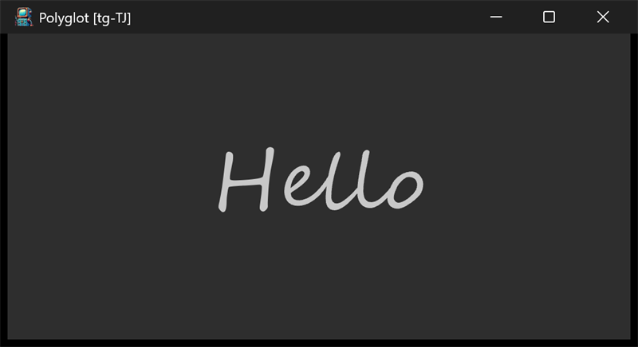

# polyglot



The window shows the word "Hello" in a script font; the title bar reads
"Polyglot [<locale>]" and the locale code changes once per second as the
sample cycles through 123 locales.

## What it demonstrates

- On-the-fly locale switching with `posix_nls.set_locale`.
- Driving periodic work from the `every_sec` view callback.
- Loading a specific font (`Segoe Script`) sized in inches with
  `ui_draw.create_font` / `ui_draw.update_fm`.
- The pointer input callbacks `tap`, `long_press`, and `double_tap`.

## Key code

A view can ask to be called once a second; that is all the animation loop
this sample needs:

```c
static void every_sec(struct ui_view* unused) {
    posix_nls.set_locale(locales[locale]);             // switch locale
    posix_str_printf(title, "Polyglot [%s]", locales[locale]);
    ui_app.set_title(title);
    ui_app.request_layout();
    locale = (locale + 1) % posix_countof(locales);
}

static void opened(void) {
    ui_app.content->every_sec = every_sec;             // periodic callback
    ui_view.add(ui_app.content, &label, null);
}
```

- `locales[]` lists 123 BCP-47 locale names ("en-US", "ja-JP", ...).
- `opened` also creates the `Segoe Script` font, attaches it to the label,
  and installs the `tap` / `long_press` / `double_tap` callbacks, which
  report whether the pointer was inside the view (`ui_view.inside` against
  `ui_app.mouse`).

## Window and layout

- Opens at 4 x 2 inches; minimum 4 x 1.5 inches.
- Dark mode. The single label is centered by the default container layout.

## Run it

Set `polyglot` as the startup project and press F5, or run
`bin\debug\x64\polyglot.exe`.

---

Prev: [sfh](sfh.md) | Next: [translucent](translucent.md)

[Index](README.md)
