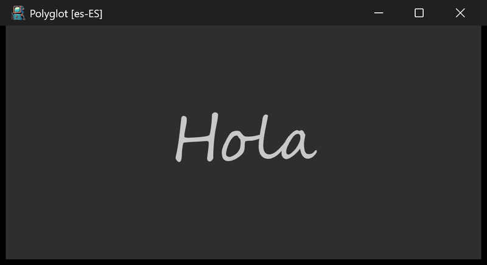

# polyglot



Once a second the greeting changes -- Hello, Hola, Bonjour, Ciao, Hallo,
Olá, ... -- in a script font, and the title bar shows the matching locale,
"Polyglot [<locale>]". The runtime locale is switched to match each
greeting.

## What it demonstrates

- On-the-fly locale switching with `posix_nls.set_locale`.
- Driving periodic work from the `every_sec` view callback.
- Loading a specific font (`Segoe Script`) sized in inches with
  `ui_draw.create_font` / `ui_draw.update_fm`.
- The pointer input callbacks `tap`, `long_press`, and `double_tap`.

## Key code

A view can ask to be called once a second; that is the whole animation
loop. Each tick picks the next greeting, switches the locale to match, and
updates the label and title:

```c
static const struct greeting { const char* locale; const char* hello; }
greetings[] = {
    { "en-US", "Hello" }, { "es-ES", "Hola" }, { "fr-FR", "Bonjour" },
    { "it-IT", "Ciao" },  { "de-DE", "Hallo" }, /* ... */
};

static void every_sec(struct ui_view* unused) {
    const struct greeting* g = &greetings[locale];
    posix_nls.set_locale(g->locale);                   // switch locale
    ui_view.set_text(&label, "%s", g->hello);          // change greeting
    posix_str_printf(title, "Polyglot [%s]", g->locale);
    ui_app.set_title(title);
    ui_app.request_layout();
    locale = (locale + 1) % posix_countof(greetings);
}

static void opened(void) {
    ui_app.content->every_sec = every_sec;             // periodic callback
    ui_view.add(ui_app.content, &label, null);
}
```

- The greetings are Latin-script so the decorative `Segoe Script` font
  renders them cleanly.
- `opened` also creates the font, attaches it to the label, and installs
  the `tap` / `long_press` / `double_tap` callbacks, which report whether
  the pointer was inside the view (`ui_view.inside` against `ui_app.mouse`).

## Window and layout

- Opens at 4 x 2 inches; minimum 4 x 1.5 inches.
- Dark mode. The single label is centered by the default container layout.

## Run it

Set `polyglot` as the startup project and press F5, or run
`bin\debug\x64\polyglot.exe`.

---

Prev: [sfh](sfh.md) | Next: [translucent](translucent.md)

[Index](README.md)
