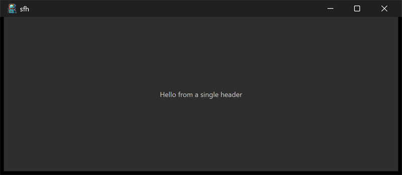

# sfh



A minimal window showing "Hello from a single header". Its purpose is not
the window but how it is built: the entire stack is pulled in through one
generated single-file header. It is the simplest sample, so it is a good
place to start.

## What it demonstrates

- The single-file-header (sfh) consumption mode, the stb way.
- One translation unit defining every module's implementation and then
  including only the top header.
- The layered amalgams: `sfh_ui.h` includes `sfh_posix.h`, which includes
  `sfh_core.h`, each carrying its own implementation guarded against
  double emission.

## Key code

The whole program, minus the C++ Direct2D backend, is this:

```c
#define core_implementation
#define trace_implementation
#define posix_implementation
#define ui_implementation
#include "sfh_ui.h"

static ui_label_t hello = ui_label(0.0, "Hello from a single header");

static void opened(void) {
    ui_view.add(ui_app.content, &hello, null);
}
```

- The four `*_implementation` defines ask each amalgam to emit its code
  into this translation unit; the layered includes pull in the others.
- `dxd.cpp` is C++ and is compiled and linked separately; everything else
  comes from the single header.

The `include/sfh_*.h` headers are generated from `include/` and `src/` by
`tools/amalgamate`. They are checked in for grab-and-go use, and
`.gitattributes` pins their line endings so regenerating them does not
churn the diff.

## Window and layout

- Opens at 5 x 2 inches. The label is centered.

## Run it

Set `sfh` as the startup project and press F5, or run
`bin\debug\x64\sfh.exe`. Compare with the other samples, which instead link
the prebuilt `ui.lib` and compile only their own `.c`.

---

Next: [polyglot](polyglot.md)

[Index](README.md)
