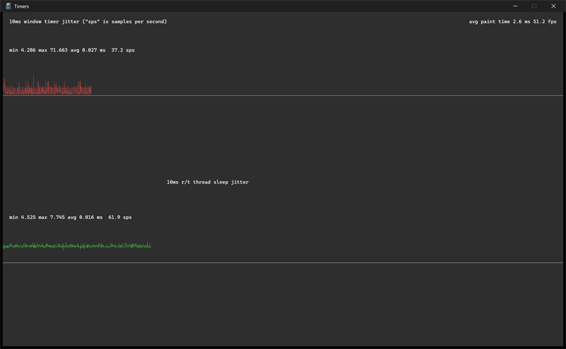

# timers



A diagnostic that measures and graphs timer jitter. The top half plots the
jitter of a 10 ms window timer (red); the bottom half plots the jitter of a
realtime thread sleeping in a loop (green). Each graph is labelled with its
min, max, and average delta in milliseconds and a samples-per-second rate;
the top right shows the average paint time and frame rate.

## What it demonstrates

- A periodic window timer via `ui_app.set_timer`.
- A realtime worker thread (`posix_thread.realtime`) sleeping in a tight
  loop for comparison.
- Collecting timestamps into circular buffers and computing statistics.
- Drawing polylines and text directly in a `paint` callback
  (`ui_draw.poly`, `ui_draw.line`, `ui_draw.text_va`).
- Clean shutdown of threads, including detached threads, on close.

## Key code

A 10 ms window timer and a realtime thread are started together; each
records a timestamp into its own ring buffer, and `paint` turns the ring
into a graph:

```c
static void opened(void) {
    timer10ms = ui_app.set_timer((uintptr_t)&timer10ms, 10);  // 10 ms
    thread    = posix_thread.start(timer_thread, &quit);      // realtime
}

static void timer(struct ui_view* v, ui_timer_t id) {
    if (id == timer10ms) {
        ts[0].time[ts[0].pos] = ui_app.now;       // timestamp this tick
        ts[0].pos = (ts[0].pos + 1) % N;
        ui_app.request_redraw();
    }
}
```

- `ts[2]` holds two stats records: index 0 for the window timer, index 1
  for the realtime thread. Each keeps a ring of timestamps and running
  min / max / average / spread.
- `paint` recomputes `stats` and draws two graphs with `graph`, scaling
  each delta into a half-height band. `composed` clamps the sample count to
  the view width so the graph fits.
- `closed` stops the timer, joins the thread, then spawns detached threads
  to verify the process still exits cleanly.

## Window and layout

- Opens at 10 x 6 inches; minimum 9 x 5 inches.
- The two graphs split the window top and bottom; both grow from the left
  as samples accumulate.

## Run it

Set `timers` as the startup project and press F5, or run
`bin\debug\x64\timers.exe`. Let it run a few seconds to fill the graphs.

---

Prev: [fractal](fractal.md) | Next: [groot](groot.md)

[Index](README.md)
