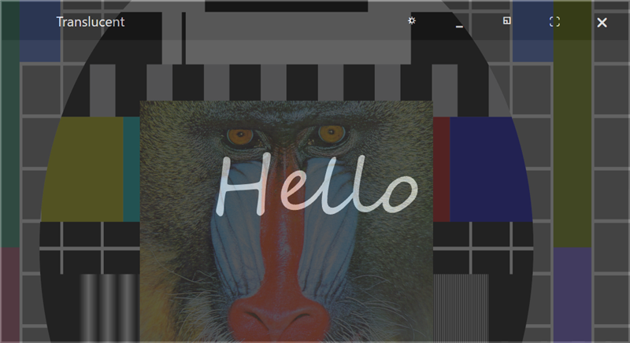

# translucent



A borderless window showing "Hello" in a script font. The window is 75%
translucent: in the screenshot it sits over the mandrill sample so the
image shows through. The caption (shown here because the pointer is near
the top edge) is the window's own, not the system one. (A normal screen
grab is used for this page, because the translucency is only visible
composited against whatever is behind the window.)

## What it demonstrates

- A layered, semi-transparent top-level window via
  `ui_app.set_layered_window(color, alpha)`.
- A borderless window (`ui_app.no_decor = true`) with a custom caption.
- A custom hit test that reveals or hides the caption depending on where
  the pointer is, and lets the body act as a drag handle.
- Setting the caption bar height (this sample makes it taller than the
  short system default).
- Full-screen toggle on F11 and quit on ESC.

## Key code

The window is made translucent in one call, and a hit test gives the
borderless window its behavior:

```c
// 75% translucent over a dark fill
ui_app.set_layered_window(ui_color_rgb(30, 30, 30), 0.75f);

// the body is the drag handle; the caption appears only near the top edge
static int64_t hit_test(const struct ui_view* v, struct ui_point pt) {
    if (ui_view.inside(v, &pt)) {
        ui_app.caption->state.hidden = !(pt.y < v->fm->em.h);
        ui_app.request_layout();
        return ui.hit_test.caption;       // drag anywhere in the body
    }
    return ui.hit_test.nowhere;
}
```

- `init` sets `no_decor`, hides the caption menu, and installs `character`
  (ESC quits) and `key_pressed` (F11 toggles full screen) on
  `ui_app.root`.
- `opened` creates the font, makes the window translucent, bumps
  `ui_app.caption_height` for a less-tiny title bar, adds the label, and
  installs `hit_test`.

## Window and layout

- Opens at 4 x 2 inches; minimum 1.8 x 1 inch.
- Dark mode, no decoration. The label is centered.

## Run it

Set `translucent` as the startup project and press F5, or run
`bin\debug\x64\translucent.exe`. Move it over a colorful window to see the
translucency; move the pointer to the top edge to reveal the caption.

---

Prev: [polyglot](polyglot.md) | Next: [mandrill](mandrill.md)

[Index](README.md)
